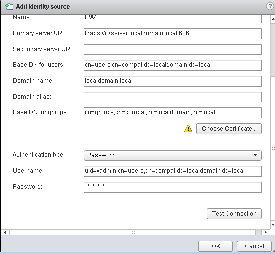

vShpere5 integration
====================

Preface
-------

The environment used to write this document is based on pure vSphere 5.1, used in trial mode with vCenter server configured as a virtual appliance.

NOTE: there is a bug in this version of vSphere regarding configuration of OpenLDAP integration in vSphere WebClient, so that you are unable to change Base DN for groups after its initial configuration. In case you need to modify that field, you have to delete and recreate the whole LDAP definition. The bug is solved in vsphere 5.1 update 1a. If anyone wants to test further integration scenarios and also test with vSPhere 5.5, he/she then can report here and I will crosscheck eventually.

IPA components
--------------

To gain interaction of IPA with VMware authentication and authorization system I used the slapi-nis (schema compat) plugin. Initially I tested it on CentOS 6.6 with IPA 3.0.0-42 and slapi-nis-0.40-4 pakages. I was able to get both users and groups enumeration in vSphere client (using _cn=accounts_ for bind definition), but then no authentication of defined users due to inability of IPA 3.0 to do bind on compat tree.

To get the bind on compat tree support I had to use IPA 3.3 and slapi-nis >= 0.47.5. They are provided for example by CentOS 7 with: ipa-server-3.3.3-28.0.1.el7.centos.3.x86\_64 and slapi-nis-0.52-4.el7.x86\_64

So I migrated my IPA test server from CentOS 6.6 to another server in CentOS 7.0, following chapter 6 of this [guide](https://access.redhat.com/documentation/en-US/Red_Hat_Enterprise_Linux/7/html/Linux_Domain_Identity_Authentication_and_Policy_Guide/upgrading.html)

LDAP tree modification
----------------------

I used two ldif files to adapt schema compat entries for vSphere

### 1) vsphere\_usermod.ldif

dn: cn=users,cn=Schema Compatibility,cn=plugins,cn=config
changetype: modify
add: schema-compat-entry-attribute
schema-compat-entry-attribute: objectclass=inetOrgPerson
-
add: schema-compat-entry-attribute
schema-compat-entry-attribute: sn=%{sn}
-

  

### 2) vsphere\_groupmod.ldif

dn: cn=groups,cn=Schema Compatibility,cn=plugins,cn=config
changetype: modify
add: schema-compat-entry-attribute
schema-compat-entry-attribute: objectclass=groupOfUniqueNames
-
add: schema-compat-entry-attribute
schema-compat-entry-attribute: uniqueMember=%mregsub("%{member}","^(.\*)accounts(.\*)","%1compat%2")
-

Applied with the following commands:

ldapmodify -x -D "cn=Directory Manager" -f vsphere\_usermod.ldif -W 

and

ldapmodify -x -D "cn=Directory Manager" -f vsphere\_groupmod.ldif -W 

Permission Update
-----------------

With [FreeIPA 4.0](https://www.freeipa.org/page/Releases/4.0.0 "Releases/4.0.0") and later, system permissions need to be updated to allow the new attributes. Run following commands as admin to allow the new sn attribute for compat users and uniqueMember for compat groups:

\# ipa permission-mod "System: Read User Compat Tree" --includedattrs sn
# ipa permission-mod "System: Read Group Compat Tree" --includedattrs uniquemember

vSphere Configuration
---------------------

The VMware configuration part has to be managed from within vSphere Web Client under Identity Sources row of

Administration -->
         Sign-On and Discovery --> 
                            Configuration

My setup is:

Primary server URL: ldaps://c7server.localdomain.local:636
Base DN for users: cn=users,cn=compat,dc=localdomain,dc=local
Domain name: localdomain.local
Base DN for groups: cn=groups,cn=compat,dc=localdomain,dc=local
Authentication type: Password
Username: uid=vadmin,cn=users,cn=compat,dc=localdomain,dc=local

resembled in the image below

Click on _Test Connection_ button to verify parameters are correct.

The _vadmin_ is a normal IPA user I created only for bind with no ESX permissions at all (it is only part of the default ipausers IPA group)

I used the secure protocol with **ldaps://** connection string. I used the file **/etc/ipa/ca.crt** on the IPA server as the certificate to give to vSphere in input; I only needed to copy it to the client where the browser for vSphere Web Client was running and rename it to **ca.cer** without any modification at all. vSphere accepted it without any problem.

Test cases
----------

I successfully executed this set of tests at the moment using both vSphere fat client (5.1 1471691) and vSphere Web Client (Version 5.1.0 Build 869765):

*   add gcecchi IPA user at top vcenter server permissions level as a virtual machine user (sample) default role
*   verify gcecchi is able to connect both in fat and web clients
*   edit settings of the vm VC1 and verify that the "add..." button in hardware tab is greyed out
*   add the defined esxpower IPA group at VC1 permissions level granting it the virtual machine power user (sample) role
*   logout/login gcecchi and verify nothing changed in his permissions
*   add gcecchi to the IPA group esxpower
*   logout/login gcecchi and verify the user now can select the "add..." button in hardware tab of VC1
*   logout gcecchi and remove gcecchi from IPA group esxpower
*   login as gcecchi in vSphere and verify that now the "add..." button is disabled again
*   create an IPA group named esxnestedpower and insert it in esxpower group
*   login as gcecchi in vSphere and verify he is still unable to add devices
*   modify IPA user gcecchi adding him to esxnestedpower group
*   logout/login gcecchi from vSphere and verify that now gcecchi is able to add device to VC1

  
Here below a screenshot with the permissions applied on the virtual machine VC1

.. figure:: Ipa_and_vsphere.png
   :alt: Ipa_and_vsphere.png

Further notes due to upgrade from IPA 3.0 to 3.3
------------------------------------------------

My tests began in CentOS 6.6. I noticed that the IPA groups created when in IPA 3.0 and CentOS 6.6 didn't get the uniqueMember property for their group members... I didn't investigate more, but I noticed that instead for the system group "admins" and for newly created groups it was ok. So I recreated the three groups already existing in IPA 3.0. As an alternative, one can think of creating a new group and but inside the old group as a nested group. After my migration from IPA 3.0 to 3.3 it seems I lost dna settings and group addition in IPA failed without explicitly specifying its GID. I solved as described here adding the missing entry **dnaNextRange: 1639600001-1639799999**: [\[1\]](https://www.redhat.com/archives/freeipa-users/2014-December/msg00090.html)

Example outputs from ldapsearch command
---------------------------------------

\[root@c7server \]# ldapsearch -x -b "cn=groups,cn=compat,dc=localdomain,dc=local" cn=esxpower
# extended LDIF
#
# LDAPv3
# base <cn=groups,cn=compat,dc=localdomain,dc=local> with scope subtree
# filter: cn=esxpower
# requesting: ALL
#

# esxpower, groups, compat, localdomain.local
dn: cn=esxpower,cn=groups,cn=compat,dc=localdomain,dc=local
objectClass: posixGroup
objectClass: groupOfUniqueNames
objectClass: top
gidNumber: 1639600010
memberUid: gcecchi
uniqueMember: cn=esxnestedpower,cn=groups,cn=compat,dc=localdomain,dc=local
cn: esxpower

# search result
search: 2
result: 0 Success

# numResponses: 2
# numEntries: 1

\[root@c7server slapd-LOCALDOMAIN-LOCAL\]# ldapsearch -x -b "cn=groups,cn=compat,dc=localdomain,dc=local" cn=esxnestedpower
# extended LDIF
#
# LDAPv3
# base <cn=groups,cn=compat,dc=localdomain,dc=local> with scope subtree
# filter: cn=esxnestedpower
# requesting: ALL
#

# esxnestedpower, groups, compat, localdomain.local
dn: cn=esxnestedpower,cn=groups,cn=compat,dc=localdomain,dc=local
objectClass: posixGroup
objectClass: groupOfUniqueNames
objectClass: top
gidNumber: 1639600012
memberUid: gcecchi
uniqueMember: uid=gcecchi,cn=users,cn=compat,dc=localdomain,dc=local
cn: esxnestedpower

# search result
search: 2
result: 0 Success

# numResponses: 2
# numEntries: 1
 
\[root@c7server slapd-LOCALDOMAIN-LOCAL\]# ldapsearch -x -b "cn=users,cn=compat,dc=localdomain,dc=local" uid=gcecchi
# extended LDIF
#
# LDAPv3
# base <cn=users,cn=compat,dc=localdomain,dc=local> with scope subtree
# filter: uid=gcecchi
# requesting: ALL
#

# gcecchi, users, compat, localdomain.local
dn: uid=gcecchi,cn=users,cn=compat,dc=localdomain,dc=local
objectClass: posixAccount
objectClass: uniqueMember
objectClass: inetOrgPerson
objectClass: extensibleObject
objectClass: top
objectClass: organizationalPerson
objectClass: person
gecos: Gianluca Cecchi
cn: Gianluca Cecchi
uidNumber: 1639600001
gidNumber: 1639600001
loginShell: /bin/sh
homeDirectory: /home/gcecchi
uid: gcecchi

# search result
search: 2
result: 0 Success

# numResponses: 2
# numEntries: 1

Author
------

Provided by: Gianluca Cecchi