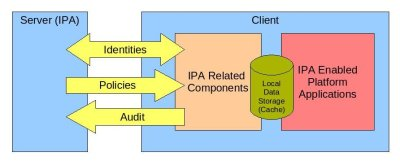
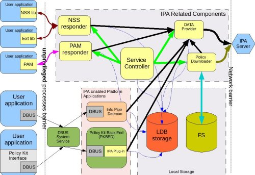
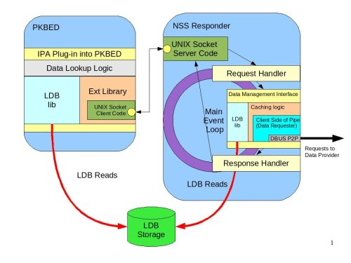
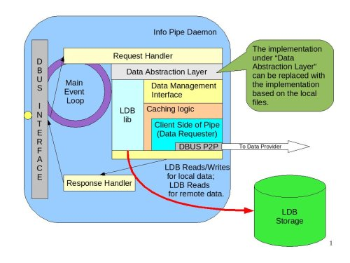

IPA_Client_Design_Overview
==========================

Overview
========

This document serves to provide a detailed design of the client
components that will be developed as part of the IPA v2 project. It is
important to realize that the collection of components, services,
libraries and interfaces discussed here has a wider scope than IPA
itself. We will describe not only the services that will be built as
part of the IPA project, but also components that will exist regardless
of any IPA service provider being utilized. For example, in the future,
an Active Directory (AD) provider may be introduced, as well as other
third party components.

Introduction
============

Context
-------

The first step is to provide some context. It is assumed that regardless
of whether the machine is hooked into IPA or not, a set of processes
will be developed in the scope of the IPA v2 project (by the IPA team or
other teams) that will become part of Fedora and will be available as a
part of that platform. IPA will then use the pluggable architecture to
add necessary functionality.

The components that are IPA-specific will be developed by the IPA team.
It is possible that in future some of the processes and libraries
developed in the scope of this project will be reused by other service
providers (connections to AD or other sources of IDM information), thus
creating a common set of entities that would become part of the
pre-installed set of components. While we acknowledge this possibility
we do not want to go that far at the moment.

Terminology
-----------

It is important to define the terminology that we will use in this
specification because we want to be sure we are talking about the same
things and that new terms are clear and understandable. Every name that
appears on the diagrams (if it is used in a specific context in this
project) is described on this page. I will try to get gradually complex
and introduce new entities and terms as we progress.

Description
===========

High-Level Diagram
------------------

The following diagram gives a very high-level view of the client-related
components.

   Detailed_client_design_high_level_view.jpg

The server and client will exchange identity-related information. The
client will periodically download policy information and upload audit
logs.

The *IPA related components* are the components that are treated as part
of IPA. They are not installed as part of the operating system and
require users to install and configure the IPA client. The *IPA enabled
platform applications* are applications that exist as part of the OS and
are ready for integration with IPA if and when it is installed and
configured. The *Local data storage*, also referred to as *Cache*, is
local data storage that is used for different purposes. The platform
applications can (and some will) use this storage to hold local (node
specific) data. IPA (or other providers) will use it to store the data
downloaded from the server for the offline case and to enhance
performance. The details about each of those components are covered in
the diagrams below.

The following aspects of the system are not discussed here:

#. Client Installation and Configuration Scripts – they are not shown on
   any diagram below but it is implied that they will be installed and
   used when the IPA client is installed or configured.
#. Components and processes related to a machine's identity. This aspect
   will be discussed separately.
#. Audit related components. This aspect is covered on a separate page.
   That page (PAGE TBD) shows the integration of the audit client
   components with the components described here.

IPA-Enabled Platform Applications
----------------------------------------------------------------------------------------------

These applications currently either do not exist or are not IPA-enabled.
So far we have identified two applications: the Policy Kit Back-End
Daemon (PKBED) and the Info Pipe Daemon (IPD).

Policy Kit Back-End Daemon
^^^^^^^^^^^^^^^^^^^^^^^^^^

| Policy Kit is an interface that applications can use to determine
  whether a user is authorized to perform an action. It is mostly, and
  currently, applicable to desktop applications. For example, “Does the
  current user have the necessary permissions to update the system
  time?”. When each application is installed, it is designed to install
  a set of actions and rules about "who can do what" (*Authorization
  Rules*). The current implementation of Policy Kit uses local files to
  store this information. In future, these Authorization Rules, as well
  as information about groups of users, roles and user identities, will
  be defined centrally in IPA (or another IDM provider). In order to
  support different sources of information, a Policy Kit Back-End Daemon
  (*PKBED*) will be created.
| The `PolicyKit Plug-In
  Architecture <http://www.freedesktop.org/wiki/Software/PolicyKit/PluggableArchitecture>`__
  page on the `PolicyKit
  Wiki <http://www.freedesktop.org/wiki/Software/PolicyKit>`__ talks
  about this effort in greater detail.

The IPA plug-in for the PKBED will be discussed later.

Info Pipe Daemon
^^^^^^^^^^^^^^^^

The desktop team identified the need to store much more information
about users than is currently possible using local password files. This
information is currently stored in local files. An example is a welcome
screen bitmap image or a user photo. Moving forward, for local users,
this information will be provided locally, but for the centrally defined
users the information will be delivered from the central server to each
machine and stored in local storage, and thus be synchronized. The
Desktop Team plans to move from using the current files to using local
storage, however it is expected that for greater flexibility the new
daemon shall be able to get information both from files and from local
storage. The whole purpose of the new daemon is to serve user-related
information to any application that needs it.

A more detailed diagram of the Info Pipe Daemon design is available in
the Design section below.

Local Storage (Cache)
----------------------------------------------------------------------------------------------

| Local storage is also referred to as cache.
| The purposes of the cache are to:

-  Store local configuration and user information in a structured
   manner, similar to the way it is stored on the IDM server.
-  Serve as a local information store when the machine is offline.

   If the machine is part of a domain (IPA or other in future) but
   cannot access the central server, the cache will continue to operate
   beyond its normal timeout period.

-  Improve performance by storing information locally, removing the need
   for round trips to the central server on each lookup.

Characteristics of the cache:

-  Makes common information available for system applications
-  Provides a structured way to store information (similar to a DB or
   LDAP)
-  Is persistent across reboots

Forms of storage:

-  LDB
-  File system

Details about Forms of Storage
^^^^^^^^^^^^^^^^^^^^^^^^^^^^^^

It is important to emphasize that the two forms of storage are not
alternatives but rather complementary, and that each form of storage
will hold different information. During analysis of the policies and
identities for the IPA implementation we concluded that there are two
different classes of information to consider. The distinction is vague
but we tried to define criteria that separates the two classes. The
following table compares these classes of information and tries to give
an overview of how and why they are different.

+-----------------+-----------------+-----------------+-----------------+
| Name            | Meaning         | Form of storage | Form of         |
|                 |                 |                 | delivery        |
+=================+=================+=================+=================+
| Identity        | Identity        | | LDB.          | Fetched over    |
| Information     | information is  | | See LDB       | LDAP connection |
|                 | information     |   description   | from client to  |
|                 | about users,    |   below.        | server.         |
|                 | groups, roles,  |                 |                 |
|                 | etc. This       |                 |                 |
|                 | information     |                 |                 |
|                 | frequently      |                 |                 |
|                 | changes and it  |                 |                 |
|                 | is important    |                 |                 |
|                 | that these      |                 |                 |
|                 | changes be      |                 |                 |
|                 | readily         |                 |                 |
|                 | available.      |                 |                 |
|                 | Consequently,   |                 |                 |
|                 | on the IPA      |                 |                 |
|                 | side, this      |                 |                 |
|                 | information is  |                 |                 |
|                 | stored in the   |                 |                 |
|                 | DS.             |                 |                 |
+-----------------+-----------------+-----------------+-----------------+
| Policy          | Policy          | File system     | It is expected  |
| Information     | information is  |                 | that policies   |
|                 | more static. It |                 | on the server   |
|                 | is not expected |                 | side will be    |
|                 | to change       |                 | stored as blobs |
|                 | frequently.     |                 | in DS or in     |
|                 | Once defined it |                 | files (at the   |
|                 | will rarely be  |                 | time of writing |
|                 | modified. A     |                 | the final       |
|                 | good example is |                 | decision has    |
|                 | a policy that   |                 | yet to be made  |
|                 | defines the     |                 | based on        |
|                 | contents of the |                 | further         |
|                 | sudoers file or |                 | investigation). |
|                 | SELinux policy. |                 | Most likely XML |
|                 |                 |                 | blobs will be   |
|                 |                 |                 | downloaded from |
|                 |                 |                 | the server      |
|                 |                 |                 | through the     |
|                 |                 |                 | XML-RPC         |
|                 |                 |                 | interface.      |
+-----------------+-----------------+-----------------+-----------------+

| 

LDB
^^^

| LDB is a memory-mapped, LDAP-like database with persistence
  capabilities developed by the Samba project. Being memory mapped
  storage, it is quite fast and can act as a cache for dynamic identity
  data for which IPA will be the authoritative source. It can also be
  used to store local data. The Info Pipe plans to take advantage of
  this aspect. LDB, being a local, LDAP-like database, allows storing
  data retrieved from DS in the same format as it is stored centrally.
| Access to LDB is provided via an LDB library that the Info Pipe will
  use to access data.

File System
^^^^^^^^^^^

Downloaded policy files will be stored in the file system. The XML files
will be stored locally in a predefined directory so that they are not
requested unless there is a new policy on the server. Policies are
related to different applications. The application configuration
handlers will process the downloaded XML files and translate them into
configuration files that applications can use. In some cases
configuration handlers might post information directly into the LDB
cache. An example of such case would be a centrally defined policy that
would be locally enforced using Policy Kit. See more details in the
Design section below.

IPA-Related Components
----------------------------------------------------------------------------------------------

The IPA-related components are installed as part of the IPA package.
Among others, the following binaries will be installed:

-  **Data Provider** – the service responsible for retrieving identity
   and other dynamic information from IPA using the LDAP protocol.
-  **Policy Downloader** – the service responsible for downloading and
   processing policies represented by XML files.
-  **PAM library** – a lightweight PAM module that will communicate with
   IPA through the PAM responder.
-  **PAM responder** – the service that performs the heavy-lifting for
   the PAM module.
-  **NSS library** – an NSS service front-end. It is a lightweight
   library that interacts with the NSS responder.
-  **NSS responder** – the NSS service back-end. The NSS responder
   fetches requested NSS information from the local cache and requests
   data from the central location if it is not in the cache.
-  **Ext library** – IPA will provide an interface for applications to
   centrally define and control user roles. Applications might decide to
   take advantage of Policy Kit as an authorization enforcement point or
   perform authorization themselves. To do this, applications need to
   request user role information from the IPA infrastructure. A special
   “Ext library” will be created for applications to request this
   information. The NSS responder will serve as a back-end for these
   requests. Currently we plan to use it for serving roles but in future
   the library can be extended to provide other types of information as
   the need arises.
-  **Service controller** – The process that ensures that IPA-related
   services are running.

All of the executables listed above run in the system context, while PAM
and NSS libraries can be loaded by any process from user space.

Low-Level Process Diagram
-------------------------

The following process-level diagram shows the relationship between
different client components.

   Low Level Diagram|Diagram shows processes and libraries that comprise
   the client footprint related to IPA

Legend:

-  Containers:

   -  Boxes with round corners are processes.
   -  Boxes with sharp corners inside process boxes identify
      libraries/plug-ins.
   -  Elements filled with yellow are components to be delivered by the
      IPA client package.
   -  Element in salmon pink (Info Pipe Daemon) will be built jointly by
      the IPA and desktop teams.
   -  Elements in green include already existing system DBUS and a new
      service – Policy Kit Back End Daemon developed by desktop team.
   -  Userspace applications are shown in blue on the left side of the
      picture.
   -  The red cylinder is the local store and cache database. It is
      based on LDB and is used by all components that are part of the
      IPA client.
   -  A special area will be allocated on the file system to store
      copies of XML files.

-  Connectors:

   -  Red curved lines identify UNIX, socket-based connections between
      NSS or Ext libraries and the NSS responder.
   -  Thick, black, straight lines are the communication pipes between
      different components and the data provider to request data be put
      into the cache. This pipe needs to be a bit more intelligent than
      the NSS socket layer and provide the capability to pass structures
      and request operations. We plan to use the DBUS peer-to-peer
      library for this interface.
   -  The magenta line denotes the communication pipe between the PAM
      module and the PAM responder. The PAM responder will probably use
      the same UNIX socket used in the NSS responder, or a similar one.
   -  Curved, black lines identify communication channels between the
      data provider and the central server – IPA.
   -  Curved, olive-green lines identify requests for policy downloads
      and delivery via the XML-RPC interface.
   -  Thin, straight, black lines show communication flow via DBUS.
   -  Thin, blue, dotted lines show interactions between different
      processes and the LDB data storage.
   -  Green lines indicate relationships between the Service Controller
      and the processes it monitors and controls.
   -  The thick, blue line identifies the fact that the downloaded XML
      data will be stored in the file system cache.

Detailed Design
===============

This section provides a more detailed description of the components
depicted on the low-level diagram.

Service Controller
------------------

| The Service Controller is a lightweight process that ensures that all
  processes are running. It is also responsible for starting and
  stopping IPA client processes and restarting them after an update.
| The Service Controller reads its configuration from the LDB. This data
  will be populated in the LDB at installation time, and can be changed
  by the policy engine (if used) or by an administrator using
  appropriate ldbtools (ldbedit, ldbmodify, etc.)

Implementation details related to the Service Controller can be found on
the following page:
`FreeIPAv2:SSSD/Service_Controller_Daemon <FreeIPAv2:SSSD/Service_Controller_Daemon>`__.

Data Provider
-------------

The Data Provider is a service that connects to the remote source of
information and retrieves all information (on demand) required for PAM,
NSS, and other services. All fetched information is stored in the LDB.
In the v2 implementation the data provider will fetch data from an IPA
server via an LDAP connection. This may be a long-lived, secure,
authenticated connection. We will use certificates or machine keytabs
(TBD) provisioned during the enrolment process to authenticate this
connection.

Alternatives to the IPA Provider
----------------------------------------------------------------------------------------------

In future we plan to support bindings with other providers, for example
with AD. The data provider will be modified to create a pluggable
interface that would allow machines to be a part of a non-IPA domain.
This is outside the scope of the IPA v2 project, however, and will be
revisited later.

Data Flow in the System
----------------------------------------------------------------------------------------------

The Data Provider is the main source of the remote data that processes
need. The following section describes how processes interact with the
Data Provider.

Overview
^^^^^^^^

The diagram below shows the design of the Data Provider and client
aspects of the interprocess communication pipe.

.. figure:: Data_Provider_Diagram.jpg
   :alt: Data Provider Digram|Diagram shows the data flow, libraries and interfaces

   Data Provider Digram|Diagram shows the data flow, libraries and
   interfaces

Data Management Interface
^^^^^^^^^^^^^^^^^^^^^^^^^

The Data Management Interface is an interface for applications that need
to retrieve data either from the local LDB storage or from the Data
Provider. It is mainly focused on reading data but there are some write
use cases too. The interface partially abstracts the source of the data
from the application. The interface consists of two parts:

-  Data abstraction layer – abstracts the fact that the data could have
   been fetched from the LDB or from the Data Provider. Most of the
   applications will use this layer since they do not care where the
   information comes from.
-  Direct LDB interface – in some cases the application needs to access
   the LDB cache directly. For example, for some local configuration
   data that is always present it can go to the LDB directly, especially
   during the process initialization stage. Another use case would be
   when the process needs to update the LDB with data that it needs to
   store. Info Pipe, for example, is the process that would take
   advantage of this functionality. Within the scope of IPA v2, we will
   limit Info Pipe to updating only local data, but in future we might
   consider allowing it to make changes that would be propagated to the
   central location.

Internally the data abstraction layer will implement the cache logic.

Cache Logic
^^^^^^^^^^^

The Cache Logic defines how and from where to retrieve data to satisfy
requests. The suggested logic is as follows:

-  Try to retrieve the requested data from the LDB.
-  If the data is found and not expiring, return it to application.
-  If the data is found and expiring, request a refresh of the data
   entry from the central server via the Data Provider connection (Data
   Requester), but return the found data to the application.
-  If the data is not found or expired then:

   Request data from the central server via the Data Provider connection
   (Data Requester)
   Indicate to the application that it can begin processing the next
   request. (See Acynch Processing, below)

In the success scenario, the Data Provider will retrieve data from the
central source and store it in the LDB. It would then respond to the
original request indicating that the data is ready. The response will be
received by the client side of the pipe and the cache logic will fetch
the data from the LDB.

| In the failure cases there will be a timeout or error returned
  immediately.
| The following error conditions have been identified so far:

-  **No data provider** – this is the default status that would be
   returned immediately by the data requester if the data provider (IPA
   client) is not installed.
-  **Connection is not established** – this is the condition when the
   connection with the Data Provider is broken. This can occur when the
   IPA client is being restarted after a software update. In such a
   situation, the Data Provider can become temporarily unavailable.
-  **No connection to central server** – this is the status returned
   immediately by the data provider if it currently has no connection to
   the central server.
-  **Server is not responding** – this will happen when the client is
   not notified of data delivery to the LDB from the Data Provider in a
   given (configurable) amount of time.

| In any of these cases, the cache logic will serve expired data if that
  data was present in the LDB. If data was not present in the LDB, the
  error will be propagated to the calling application.
| Different categories of data will have different life spans.

Cache Logic Glossary
''''''''''''''''''''

-  **Expiring** - Entries in the cache have passed their refresh
   timeout. This timeout will allow us to institute an asynchronous
   cache update to reduce the number of cache misses. The client will
   receive the cached copy immediately and the cache replenishment will
   occur out-of-band.
-  **Expired** - This entry has not been looked up since passing the
   expiration timeout. This timeout should be longer than the refresh
   timeout (it should also be enforced that the difference between them
   be great enough to account for an out-of-band request completing).
   This qualifies as a cache miss (slowest response) and will require a
   real-time cache refresh before replying to the client.

Online Cache Logic By Example
'''''''''''''''''''''''''''''

Consider the following case where the refresh timeout is 150 seconds and
the expiration timeout is 300 seconds. This will describe the online
case (full connectivity to the IPA server)

#. The user performs an authentication request for the first time. This
   is a cache miss, the worst possible performance. The auth daemon
   communicates to IPA over the network, gets the result and adds it to
   the local cache along with a refresh timout timeout value (150
   seconds) and the expiration timeout value (300 seconds), and then
   returns the result to the user from the newly cached entry.
#. The user makes a second authentication request for the same resource
   60 seconds later. The response is returned by the cache. This is the
   fastest performance case, the cache-hit.
#. The user makes a third authentication request for the resource 95
   seconds after that (a total of 155 seconds). At this time, we have
   passed the refresh timeout, but not the expiration timeout. The
   cached value is immediately returned to the user as with a standard
   cache-hit for maximum performance. After the transaction with the
   user is complete, the cache process will add the request to a queue
   of cache refresh requests. This will refresh the cache asynchronously
   from the user requests. The client process continues on needing no
   knowledge of this occurrence.
#. The user makes a fourth authentication request for that resource ten
   minutes later. This is beyond the cache expiration timeout, and we
   treat it as a cache miss, as in step 1. The cache is refreshed from
   the IPA server and then returns the result to the client (albeit
   slowly).

With this approach, we can maximize the number of cache hits while still
maintaining fresh data. For very high-traffic requests (dozens of
requests per minute or more) this will translate to two IPA requests
every five minutes (in this example), and hundreds of cache-hit replies.
In the worst case, where a user makes requests less often than the cache
timeout, we still only see one IPA request per user request greater than
five minutes.

DBUS P2P
^^^^^^^^

For communication between clients and the Data Provider, we will use the
DBUS peer-to-peer library. This is a library that allows easy
implementation of the direct, process-to-process, client/server
communication. It is capable of convenient RMI data exchange. The
requests going from client to server (data provider) will be data
“requests”. The server will respond with a “signal” when data is ready.

More details about DBUS can be found here:
`1 <http://dbus.freedesktop.org/doc/api/html/group__DBus.html>`__

Asynchronous Processing
^^^^^^^^^^^^^^^^^^^^^^^

High performance and maximum throughput are the goals of the current
design. It is crucial to avoid any possible data bottlenecks. One way to
implement efficient processing of the high volume of requests is to
avoid blocking the process while it is waiting for data to be fetched.
While data is being located the server should continue processing other
requests. To achieve this, the Data Provider (as well as all other
“servers” on the low-level design diagram) will be implemented using an
asynchronous approach. The IPA development team will take advantage of
the Event library developed in the scope of the Samba project
([www.samba.org]). Unfortunately, the Event library is not well
documented. The IPA team will add more detail to this aspect of the
design as the Event library is investigated further.

Data Provider Overview
^^^^^^^^^^^^^^^^^^^^^^

| The Data Provider will instantiate a DBUS server that will listen on a
  UNIX socket to incoming requests from the clients. Only clients
  running in system space will be served. Connections from clients that
  are in user space will be denied access. The interface will not be
  public and will be completely controlled by the IPA team for several
  releases to come. If you are developing an application and are
  interested in using this interface directly, you need to contact the
  IPA team and gather more details about the current state of the
  interface.
| The Data Provider will implement an asynchronous processing approach.
  Every request received by the server will be processed by the request
  handler. While data is being fetched from the IPA server, the Data
  Provider will be processing other requests. As soon as data is
  received (or a timeout occurs) the event will be triggered and a
  response handler (callback) will be invoked. The Response Handler will
  then place the data into the LDB. Care must be taken to prevent events
  interrupting each other in the middle of the LDB update. The Response
  Handler will also trigger a signal to the client that the data is
  ready.

What Data can be Requested
^^^^^^^^^^^^^^^^^^^^^^^^^^

Clients will usually request one entry at a time, however there might be
several special requests that have already been identified:

-  Request to pre-populate the LDB with data needed for NSS to quickly
   serve its maps.
-  Statistics. The debugging and testing tools might ask the data
   provider for its status and statistics.
-  Who is connected. This capability can also be leveraged by the
   Service Monitor. Instead of periodically polling to check if the
   processes are running, it might instead connect to the Data Provider
   and ask who is connected. It can also subscribe to receive a signal
   if some process disconnects. This might be a more efficient way of
   monitoring the system. The problem with such an approach is that the
   Service Controller becomes very closely coupled with the Data
   Provider and cannot be easily reused as-is on the server side if
   needed.

Authoritative Sources of Data
^^^^^^^^^^^^^^^^^^^^^^^^^^^^^

Generally speaking, two kinds of data are stored in the LDB and needed
by the various processes:

| Local : Data defined on the machine itself via local files. In the
  future, this will also refer to locally-stored Info Pipe data.
| Remote : Data fetched from a centralized location (IPA server)

It should be clear that from the perspective of the client software the
IPA server (via the Data Provider) is the authoritative source of the
remote information.

The situation with local information is much more complex.

The ultimate goal is to have all local data stored in the LDB and
managed using the Info Pipe, completely replacing the local files. This,
however, would not happen overnight. To provide an easier adoption and
migration from the current state to the local identities managed via
Info Pipe in the LDB we will try to provide the following options in v2
and later:

#. Info Pipe with the back-end storing all information in the LDB for
   all local accounts. This is the ultimate situation. The local files
   will be migrated to the LDB when the platform is upgraded, after
   which files will not be used at all. The NSS and PAM authentications
   will use LDB; local files will not be used at all. Our PAM and NSS
   modules will be moved to be first in the stack. This would require
   high stability and reliability of the PAM responder code to prevent
   machine lockout. This approach, though implemented, might not be
   widely adopted because the first version is usually not stable enough
   for such critical parts of the infrastructure as PAM and NSS.
#. Info Pipe with the back-end storing extended user information in the
   files. This implies that the local password files would be the
   ultimate source of user information and Info Pipe would manage extra
   information like user bitmaps in its proprietary files and NOT in the
   LDB. This back end implementation (if implemented) will be provided
   by the desktop team.
#. Info Pipe with user information in files and extended information in
   the LDB. This is an option we might not implement in v2.
   Regardless of the Info Pipe presence the PAM and NSS stacks at least
   in v2 will be configured by default to get information from the local
   configuration files. This means that the PAM and NSS parts of the
   client should not expect to be asked about information stored in the
   local files at all. If the machine is fully migrated there will be no
   local files at all so NSS and PAM look-ups will fall through. But if
   it is not a fully migrated machine and files still exist, then the
   look-ups will use local files. For example, for local root logging
   into the box the pam_unix will perform authentication and control
   will never be passed to the PAM module discussed on this page.
   Similarly with NSS, in the first implementation we will configure
   nsswitch.conf to check the local files for user, group and other
   similar information before even trying to get information from the
   local LDB or external provider. This, however, creates a naming
   conflict if locally defined users or groups have the same names as
   users and groups defined in the central location (IPA). For the first
   implementation we will require that customers avoid such collisions
   unless they realize that a local user can be returned as a member of
   the centrally defined group. To avoid this collision in the future we
   might consider returning fully qualified names in the NSS lookups.
   This approach would need to be evaluated more because in this case
   our NSS module would have to be the first one, creating the same
   concerns as were outlined above.
#. The Info Pipe will manage local users with UIDs above some
   configurable value. Red Hat has traditionally used UIDs greater than
   500, Debian-based systems use 1000. Those accounts will have all
   their information in the LDB while accounts with lower UIDs will be
   stored in the local files. PAM and NSS will be configured in such a
   way that local files would go first so PAM and NSS discussed below
   would not get requests about local accounts or groups at all. If the
   user is not in the local files the cache logic will (if Info Pipe is
   present) first check local user information stored in LDB and only
   after that will check the remote portion and request an update from
   the provider if needed. We will implement this approach if we have
   time. It is a slight compromise of options a) and c) and allows a
   smoother migration path.

PAM
---

The following diagram illustrates the internals of the PAM library and
PAM responder.

.. figure:: PAM_Diagram.jpg
   :alt: PAM Diagram|Diagram illustrating how the PAM responder would work

   PAM Diagram|Diagram illustrating how the PAM responder would work

The PAM library is a very lightweight implementation of the standard PAM
interface. All requests to the interface that require any kind of
processing will be marshaled to the PAM responder over the UNIX sockets
layer (most likely). Inside the PAM responder the main processing loop
will be implemented in much the same way as in the Data Provider:

-  Requests will be read from the socket and processed by the Request
   Handler.
-  The Data Management interface will be used to collect the data
   necessary for authorization checks
-  The actual authentication will be forwarded to the Data Provider. The
   Data Provider will be the kerberized component capable of performing
   machine authentication or requesting user authentication on behalf of
   the PAM responder.
-  The PAM responder will be implemented following the asynchronous
   processing paradigm. While data is fetched by the provider or
   authentication is performed, the PAM responder will be processing
   other requests.
-  The Response Handler callback will be invoked when the external
   processing of data is complete. The response will be prepared for the
   client and sent back to the library over the UNIX socket.
-  The response will be unpackaged. In some cases there would be some
   post-processing required inside the library. A good example of this
   post-processing is setting the environment variables. For example,
   setting the variable that points to the Kerberos ticket so that child
   processes of the user process can access the Kerberos ticket and
   participate in the SSO.
-  The results are passed back to the calling application via a standard
   interface.

Access Control Decision
----------------------------------------------------------------------------------------------

While processing the authentication initiated via the PAM stack, the
client must ensure that the user trying to access the host has not only
the right identity and credentials, but is allowed to access the host.
The Kerberos server by nature will not do the authorization checks
centrally – this is the responsibility of the client software. This
means that the IPA client will perform the authorization check. The flow
of operations in this scenario will be as follows:

-  The application (ssh, telnet, ftp, console login, etc.) will collect
   the user name and password. The PAM framework will be invoked using
   standard PAM calls. Since the IPA client will be installed as the
   first PAM module in the stack, it will get all the requests.
-  The PAM module will forward the credentials to the PAM responder.
-  The PAM responder will forward the authentication request to the IPA
   provider.
-  The IPA provider will perform authentication. This will be a Kerberos
   authentication against the KDC embedded into the IPA server. If the
   client machine is offline, the authentication will be performed
   against locally cached user credentials stored in hashed or encrypted
   form in the LDB.
-  The result will be returned to the PAM responder, passed to the PAM
   library and the application itself.
-  The application will then invoke a PAM authorization call and the
   authorization request will be passed to the IPA provider in the same
   way as the authentication.
-  The PAM responder will perform authorization checks using data stored
   in the DS. The actual representation of this data and LDAP search
   specifics are discussed on a separate page (TBD to be added). Here we
   will mention that the host-based access control logic will make
   decisions based on the following factors:

   -  The identity of the user and his group membership
   -  The host he is trying to access
   -  The host he is trying to access from
   -  The service used (ftp, console login, ssh, etc.)

-  Because the authorization data is very sensitive information, the IPA
   client would perform online authentication and authorization checks
   if it can connect to the IPA server. It will only perform offline
   authentication and authorization if the IPA server is not reachable.
   This will be the default behavior. To improve the performance and
   decrease network traffic, the customer would be able to override this
   default behavior and allow authorization checks against the LDB. In
   any case the IPA provider will be the service responsible for
   performing authentication (local or remote) and making sure that user
   can access the host. All the information that the IPA provider will
   receive to make its decision will be stored in the LDB so that the
   client would be able to authenticate when the machine is offline.
   This also includes capturing a user's password and storing it in
   hashed or encrypted form in the LDB to allow user authentication if
   the machine is offline.

Pluggable Architecture
----------------------------------------------------------------------------------------------

In future the PAM responder will be extended to allow 3rd party
applications to install hooks into its processing loop. This feature
will not be implemented in the v2 time frame, and consequently its
detailed design has been deferred.

NSS and Extension Library
-------------------------

The NSS architecture and processing will be very similar to that
previously described for PAM, with the following key deviations:

-  Only following maps will be served by the NSS IPA:

   -  Passwd - User passwords, used by getpwent(3) functions.
   -  Group - Groups of users, used by getgrent(3) functions.
   -  Netgroup - Network-wide list of hosts and users, used for access
      rules. C Network names and numbers, used by getnetent(3)
      functions.
   -  Automount – Mount entry points

-  The NSS responder will also be able to serve user roles for the
   Extension Library. This is currently the only interface the Extension
   Library will have. Other functionality can be identified in the
   future. The NSS provider will listen on the same socket for requests
   coming from the NSS Library and the Ext Library. There is no need to
   have two different sockets for this because requests from the Ext
   Library are very similar to those from the NSS Library.
-  The enumeration functions by default will return errors to prevent
   downloading huge sets of data. The customer would be able to switch
   it on but he would have to acknowledge potential performance impact.
-  There will be a special command that will require the Data Provider
   to download and prepare data in the LDB that the NSS responder would
   need. This will be a request for the data set rather than the usual
   entry-by-entry requests.
-  Data ready to be shipped to the NSS Library will be cached in the NSS
   responder. The NSS interface is known to request the same data
   multiple times, so the data will be cached in the buffer format and
   will be ready to be shipped to the NSS responder at any moment.

As one can see there are some differences but also a lot of similarities
between the function of the PAM responder and the NSS responder. It
might be beneficial to combine the two responders and have a single
responder capable of responding to requests coming from NSS, Ext and PAM
libraries. This would reduce code duplication and the client footprint.
This decision will be made during the implementation phase based on the
prototype implementation of both responders.

It is important to realise that calling the NSS interface from within
the implementation of any component discussed on this page shall be done
with extreme caution to avoid endless loops during data lookups.

Policy Downloader
-----------------

The Policy Downloader is the service responsible for delivering policies
to the client machine. The following diagram shows the internals of the
Policy Downloader.

.. figure:: Policy_Downloader_Diagram.jpg
   :alt: Policy Downloder|Diagram of the Policy Downloader

   Policy Downloder|Diagram of the Policy Downloader

The policy downloader will get its configuration from the LDB. It will
then periodically query the IPA server using the LDAP interface to
identify if there are any new or updated policies that need to be
downloaded. If so, the policy downloader will use (most likely) XML-RPC
interface to download the policies from the IPA server. The policy
handler component is responsible for:

-  Saving the downloaded policy files in the file system cache
-  Merging the policies. The policies need to be merged if there are
   several policies of the same kind that are assigned to this host
   directly or through the host's group membership.
-  Transforming the policies into configuration files or storing them in
   the LDB.

Merging Policies
----------------------------------------------------------------------------------------------

The policy downloader will implement the default merge method that will
merge the policies based on their priority as defined in the IPA server.
There may, however, be situations when policies need to be merged
differently. In these cases, a specific merge plug-in can be installed
to handle a specific type of policy file. The interface of the plug-in
modules will be determined later.

Transforming Policies
----------------------------------------------------------------------------------------------

The policies are downloaded in the form of XML blobs and stored (cached)
in the file system as files. In addition, the XML policies need to be
translated into the format that the application this policy is related
to understands. For example, the XML policy for SUDO needs to be
transformed into the SUDOERS file. The IPA server will be able to
support policies for multiple, different applications. For those
applications that use flat files to store their configuration
information, a plug-in will be developed that will take an XML file and
translate it into a text file (sudoers file for SUDO) using an XSLT
template. The plug-in will be able to render different policies using
different templates. For IPA applications that store information in the
LDB, there will be a transformation plug-in that will take the IPA
policies and load them into the LDB. Most likely there will be separate
IPA-related policies for different IPA components, including: general
policies controlling how clients should behave, audit policies that
control the "A" aspect of IPA, and possibly others. The current
understanding is that the same transformation plug-in will be able to
load the policy from the XML files into the LDB for all these different
cases. Finally, different applications have different needs so there
will be cases when the policy does not need to be (or can't be) rendered
using these two types of plug-ins. In those cases a specific
transformation plug-in will be developed. So far at least one type of
such an application has been identified – SELinux. There might be others
in the future.

Most likely the plug-ins will be implemented as separate executables and
the policy downloader will just launch the appropriate one, passing in
the file as soon as the merged XML file is ready for transformation.

The policies rendered using the XSLT plug-in will be of two classes:

-  Ultimate policies - those that completely override local policies. In
   other words, if the local file exists it is overwritten.
-  Default policies - those that can be adjusted by local settings so
   that local configuration takes precedence.

This property will be specified on the IPA server side when the policy
is defined. To be able to merge policies with the local configuration
the rendered text file will then be processed using the Augeas library
(`2 <http://augeas.net/>`__).

The current plan is to load the configuration text file (rendered with
XSLT) using Augeas into the Augeas tree, and then overload this tree
with the local file and then save it back into the local file. In any
case, when dealing with the local files (either completely overwritten
or the ones that need to be merged with) the policy downloader will
store an original copy of the file to enable rollback to original state
if needed.

The implementation of each individual file's merge logic might be
specific for each type of configuration file. Most likely these merge
modules will also be implemented as separate binaries that will be
launched by the policy downloader after rendering is complete for those
policies that are marked as the “default” ones (i.e. requiring merge
with the local files).

IPA Plug-in into Policy Kit Back-End Daemon
-------------------------------------------

PKBED will be a service that answers questions about whether the user
can perform a specific action or not. The PKBED is called into existence
to be able to use different sources of information (local files or
LDB/IPA) to make such authorization decisions. To be able to make such
decisions the IPA plug-in needs to have information about the user's
role and information about what actions this role allows regarding a
specific application. The roles will be defined centrally in IPA in the
DS portion, while the mapping between roles and and what actions that
role allows will be stored in the policy (XML) section of the IPA
server. The XML part will be downloaded by the Policy Downloader and put
into the LDB using the mechanisms described above. To make a decision,
the plug-in would have to retrieve the user's role and then check the
LDB to get the list of actions the role allows. To retrieve the roles it
will use the Extension Library. For access to the LDB it will use the
LDB Library directly. The plug-in will not use the Data Management
Interface because it does not need to speak to the Data Provider
directly. Neither does it need the caching logic. This means that the
detailed diagram above is not exactly correct. It is correct
conceptually, however. Further, we are not planning to change it because
modifying it would make it harder to understand. The following diagram
illustrates the plug-in design.

   PKBED Plug-in|IPA plug-in into Policy Kit Back End Daemon

The PKBED will use the same event-based paradigm as any other daemons in
the current design. There will be an event loop using the glib main
loop. The methods on the plug-in will be asynchronous. The plug-ins
should and would never block. To accomplish this the plug-in would have
to spawn a thread (one per plug-in) to implement its own asynchronous
event processing loop. Since the plug-in will have its own internal
processing loop and will be event-based, its logic will be very similar
to the other daemons already described. The loop will consist of getting
the request from the PKBED process and submitting a request to the Ext
Library to fetch the user role. The callback that will be invoked when
the role is fetched will then reach out into the LDB and get the mapping
of the role to the set of actions. The resulting answer will then be
returned to the calling process. This logic is shown on the diagram as
“Data Lookup Logic”.

Info Pipe Daemon
----------------

Info Pipe Daemon is the service that allows applications to get and
update user related information. It allows the storage and management of
a much richer data structure than the data stored in the password file.
Firstly, of all Info Pipe Daemon allows managing data for local user
accounts. This means that it becomes the authoritative source of the
local data as it was discussed before. Info Pipe will use the LDB as its
storage irrespective of whether IPA is installed or not. There might
also be an alternative implementation when the back-end storage for Info
Pipe is files (its specific files that store information in addition to
password file). Although the goal is to migrate from files to a more
robust data storage, the design should allow decoupling the Info Pipe
daemon from the LDB and using it with the alternative back end.

In future we envisage that Info Pipe Daemon would become not only a
gateway for the applications to get and set local user data and to get
remote (IPA) user data, but would also allow saving changes into the
central location. This feature is out of scope of IPA v2.

The following diagram illustrates the internals of the Info Pipe Daemon.

   Info Pipe Daemon|Internal structure of the Info Pipe Daemon

The DBUS interface provides the set of Create/Read/Update/Delete
commands. The exact specifics, method names and parameters will be
determined later. The internal asynchronous processing loop is similar
to all other daemons described in this document. The Request Handler
will invoke a “Data Abstraction Layer” that will encapsulate access to
the back-end data storage (file or LDB).

The file-based implementation is out of scope for the current design.
The LDB-based implementation will use the Data Management Interface to
deal with the remote data and the direct LDB calls to manage local user
data. The Response Handler will be responsible for sending retrieved
data or operation status (in case of create/update/delete) to the
process that requested the operation.

Name Collision Resolution Logic
-------------------------------

With the two sets of users - locally defined on the machine and remotely
in IPA (or other data provider) - there is a need to be able to
deterministically resolve naming collisions between local and remote
users. For example, the user “dwalsh” could be a local or a remote user.
The usual way of resolving such problems is to fully qualify the name.
For example, dwalsh@local or dwalsh@ipa.redhat.com. However, it turns
out that different UNIX/Linux utilities use different kinds of
separators and interpret them differently, and there is no standard way
to fully qualify the name. We could introduce a special character that
we know is not widely used, for example “dwalsh!local”, but this is not
very user friendly. For this reason, the IPA client logic by default
shall work with the short user names and be able to determine the user.

The following algorithm is proposed to determine which user is referred
to by a provided name:

-  Lookup in local users area first
-  Lookup in the domain the machine belongs to

Trusted domains might add some additional lookups but this will be
investigated separately.

We will also support fully qualified user names with some symbol (or
several symbols) to allow applications and internal interfaces to refer
to local or remote users explicitly. Trusted domains will add a
challenge and remain something to be resolved.

If the user is looked up by UID we will follow the same set of rules. It
is generally bad practice to have overlapping UIDs or names between
local and remote users. Administrators should avoid this and ensure they
do not overlap. IPA would make decisions following the above rules but
administrators might be confused with the results not realizing the
cause of the problem. In the future, Info Pipe might be called on to
perform additional checks to ensure that the account being added does
not create duplicates and warn the caller of the issue, but this is out
of scope of the current design.

LDB Data Organization
---------------------

The following tree gives a high level overview of the LDB organizational
structure. This is an example only and subject to change as we work more
on the different aspects of the system:

| ``  cn=config``
| ``       cn=daemons``
| ``          cn=InfoPipe``
| ``               ... data related to InfoPipe configuration ``
| ``               This hive is populated at the install time with the default values.``
| ``              This area is controlled by InfoPipe.``
| ``  ``
| ``       cn=services``
| ``            ... list of services the Service Controller needs to control.``
| ``            This hive is populated at the install time with the list of services currently installed.``
| ``  ``
| ``       ...``
| ``  cn=local``
| ``       ... Local accounts information. See the discussion about the authoritative source of this information earlier on this page.``
| ``  ``
| ``  cn=remote``
| ``       cn=IPA``
| ``             cn=``
| ``                  cn=accounts``
| ``                       cn=users``
| ``                       cn=groups``
| ``                       ... And other information taken from IPA in the same format``
| ``                  cn=policies``
| ``                       ... Area where centrally downloaded policies for other applications (like applications leveraging Policy Kit) are stored.``
| ``                  cn=client``
| ``                       ... different communication timeouts, default ports, cache lifetime, default server name,  ``
| ``                       default failover, paths to machine credentials in FS, configuration about what server side entry defines the layout of the data on the server ``
| ``                       (this is needed to be able to change server DIT without updating client) etc. ``
| ``                       This hive is populated at the install time with the default values.``
| ``                       There will be a policy downloadable from IPA to overwrite the values ``
| ``                  cn=audit``
| ``                        ... policies that control audit.``
| ``                        This hive is populated at the install time with the default values.``
| ``                        There will be a policy downloadable from IPA to overwrite the values ``

In future the schema might be extended to have cn=AD, cn=SQL or other
sources of remote information on the same level as cn=IPA. v2 only
supports the inclusion of a machine in a single IPA domain. In future we
will be able to potentially support more domains; that is why the tree
is organized as shown. This tree also does not currently take into
account that it would have to store information for the multiple,
trusted IPA (or other domains). How “trust” would affect the DIT is yet
to be determined.

Service Skeleton
----------------

There is a set of common tasks that each service needs to perform. This
includes:

-  Setting up signal handlers
-  Handling input and output streams and sockets
-  Setting up the communication layer
-  Starting the main loop
-  Cleanup before shutdown

To address these common tasks a skeleton of the service will be created.
It will be reused by different daemons as a shared library that would
provide a common framework for the daemons.

Building Blocks
---------------

The following libraries have been identified as building blocks of the
IPA client:

-  Talloc – memory management library (comes from Samba [www.samba.org])
-  LDB – library to access shared memory-mapped local LDAP storage
   (comes from Samba [www.samba.org])
-  libreplace – library that provides platform compatibility abstraction
   layer (comes from Samba [www.samba.org])
-  Event library – library that provides mechanism to perform
   asynchronous processing (comes from Samba [www.samba.org])
-  DBUS library – library that provides peer-to-peer communication
   (comes from
   `3 <http://dbus.freedesktop.org/doc/dbus/api/html/index.html>`__)

General Implementation Considerations
-------------------------------------

This section discusses best practices related to the implementation of
the client components. It is planned to implement most of the services
in C, however it is not clear which language would be best for the
Policy Downloader and its plug-ins. When writing code the considerations
described below should be taken into account.

Threads
----------------------------------------------------------------------------------------------

Avoid creating threads until it is absolutely necessary. Threads in
general create a level of complexity that is much harder to implement
and test. If forced to use threads make sure that you:

-  Protect access to shared data and code with synchronization objects
   (mutex, semaphore)
-  Use only reentrant functions
-  Do not use static data

Buffer copying
----------------------------------------------------------------------------------------------

Avoid copying data around if it is not required, but if you reference
external data make sure it does not get out of scope or deallocated
while you still hold a pointer to it.

Blocking and Asynchronous Processing
----------------------------------------------------------------------------------------------

The process should never block during the data retrieval operation. The
main loop and the event library would take care of this. Refer to the
following Sample Implementation (TBD).