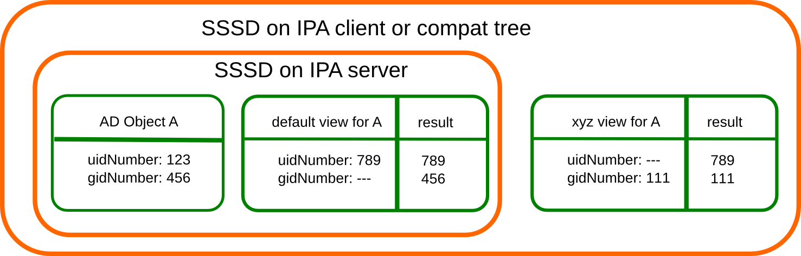

Migrating_existing_environments_to_Trust
========================================

Overview
--------

When FreeIPA server is configured with *Winsync* synchronization with
Active Directory, all users are copied to FreeIPA server with generated
POSIX attributes (e.g. login name, UID, GID, shell...). Such
architecture has several downsides, when compared to infrastructure
based on `Cross-Realm Trusts <Trusts>`__. However, it was very difficult
to migrate to it given synchronized AD users already had POSIX
attributes generated.

New **ID Views** mechanism allows configuring POSIX attributes for AD
users and thus allows admin to remove such user entity from FreeIPA
`Directory Server <Directory_Server>`__, leverage `Trusts <Trusts>`__
and only define the default (or per host group) user (or group) POSIX
attributes.

Use Cases
---------

Store POSIX attributes and SSH keys for AD users
----------------------------------------------------------------------------------------------

Define POSIX attributes or SSH users for AD users and let them be
applied when the AD user authenticates to `clients <Client>`__ running
SSSD with *ID Views* support or via `legacy compat LDAP
tree <V3/Serving_legacy_clients_for_trusts>`__.

This capability is useful both for migration from Winsync or in a
situation when Linux admins would like to manually define POSIX
attributes for AD users, but AD policy do not allow it.

Migration from the Sync to the Trust solution
----------------------------------------------------------------------------------------------

Utilize *ID Views* interface to configure needed POSIX attributes for
existing users synchronized with *Winsync* and move them back to AD. The
mechanism follows simple procedure:

#. Select a user/group entry to be migrated
#. Create a default or host-based ID View override specifying previously
   used UID or other tools
#. Backup migrated user/group
#. Delete user/group original entry

{{ admon/note \| Automated Migration \| Automated migration tool is
planned for next releases in ticket
`#4524 <https://fedorahosted.org/freeipa/ticket/4524>`__ }}

Per hostgroup override of FreeIPA user POSIX attributes
----------------------------------------------------------------------------------------------

Use *ID Views* mechanism to override FreeIPA user POSIX attributes on
specified servers that may not yet be using the unified domain ones.
This option is useful for example for users migrated from NIS.

Design
------

ID Views
----------------------------------------------------------------------------------------------

A new concept of *ID Views* is introduced. Every ID View is a collection
of user and group *overrides* that applies to specified hosts or as a
default to all hosts. Each *override* is bound to an AD or IPA user.

User Overrides
^^^^^^^^^^^^^^

Following list of user attributes can be overridden in an *ID View*:

-  **uid**: user login name
-  **uidNumber**: user UID number
-  **gidNumber**: user GID number
-  **loginShell**: user login shell
-  **gecos**: user GECOS
-  **homeDirectory**: user home directory
-  **ipaSshPubkey**: user SSH public key(s)

Group Overrides
^^^^^^^^^^^^^^^

Following list of group attributes can be overridden in an *ID View*:

-  **cn**: group name
-  **gidNumber**: group GID number

Data Flow
----------------------------------------------------------------------------------------------

|User-views.png| In an environment with a `Trust <Trusts>`__, the SSSD
on the FreeIPA server reads the data from AD and immediately apply the
overrides from the *default view* which are defined in the FreeIPA LDAP
tree. The *extdom plugin* returns this data directly to clients while
the *compat tree* reads the data from SSSD and apply the overrides from
another view if needed for the client. Clients using the *extdom plugin*
have to read client specific view data on their own from the FreeIPA
LDAP tree and apply them on their own.

ID Ranges
----------------------------------------------------------------------------------------------

ID ranges are used in FreeIPA to avoid collisions of POSIX IDs from
different domains especially if the POSIX IDs are algorithmically
generated. Although it would be possible to create a special range type
for the POSIX IDs used in ID Views, they are not needed. The main reason
is that we have to allow overlaps with all other kind of ID ranges. E.g.
AD user which where created in the FreeIPA `Directory
Server <Directory_Server>`__ tree by the winsync solution have POSIX IDs
from the same ID range as IPA users. If we want to migrate them to the
trust solution we would have to add those POSIX ID in the default view.

Another reason is that the POSIX IDs in the views are managed manually
on the FreeIPA side and conflicts and collisions can easily be fixed by
changing the offending POSIX ID. The requirement that the POSIX IDs used
in the views must match given ranges would make this feature more
cumbersome to use without adding additional protection.

Implementation
--------------

Proposed schema
----------------------------------------------------------------------------------------------

| `` attributeTypes: (2.16.840.1.113730.3.8.11.62 NAME 'ipaAnchorUUID' DESC 'Unique Anchor Identifier' EQUALITY caseIgnoreMatch ORDERING caseIgnoreOrderingMatch SYNTAX 1.3.6.1.4.1.1466.115.121.1.15 SINGLE-VALUE X-ORIGIN 'IPA v4')``
| `` attributeTypes: (2.16.840.1.113730.3.8.11.63 NAME 'ipaOriginalUid' DESC 'Original UID of overriden user' EQUALITY caseIgnoreMatch ORDERING caseIgnoreOrderingMatch SYNTAX 1.3.6.1.4.1.1466.115.121.1.15 SINGLE-VALUE X-ORIGIN 'IPA v4')``
| `` objectClasses: (2.16.840.1.113730.3.8.12.29 NAME 'ipaIDView' SUP nsContainer STRUCTURAL MAY ( description ) X-ORIGIN 'IPA v4' )``
| `` objectClasses: (2.16.840.1.113730.3.8.12.30 NAME 'ipaOverrideAnchor' SUP top STRUCTURAL MUST ( ipaAnchorUUID ) MAY ( description ) X-ORIGIN 'IPA v4' )``
| `` objectClasses: (2.16.840.1.113730.3.8.12.31 NAME 'ipaUserOverride' DESC 'Override for User Attributes' SUP ipaOverrideAnchor STRUCTURAL MAY ( uid $ uidNumber $ gidNumber $ homeDirectory $ loginShell $ gecos $ ipaOriginalUid ) X-ORIGIN 'IPA v4' )``
| `` objectClasses: (2.16.840.1.113730.3.8.12.32 NAME 'ipaGroupOverride' DESC 'Override for Group Attributes' SUP ipaOverrideAnchor STRUCTURAL MAY ( gidNumber $ cn ) X-ORIGIN 'IPA v4' )``
| `` objectClasses: (2.16.840.1.113730.3.8.12.34 NAME 'ipaOverrideTarget' SUP top STRUCTURAL MUST ( ipaAnchorUUID ) X-ORIGIN 'IPA v4' )``

Container
----------------------------------------------------------------------------------------------

ID Views will be stored in containers below
``cn=views,cn=accounts,$SUFFIX`` with containers for users and groups.
The objectclasses look similar to posixAccount and posixGroup
objectclasses but with only optional (MAY) attributes.

As view will be applied on the client side so the older clients using
the extdom plugin only get the default view. If they need a different
view SSSD has to be updated to a version with view support or the client
must use the compat tree.

On the server side we have to modify SSSD running in IPA server mode as
well and the slapi-nis plugin for the compat tree.

SSSD
----------------------------------------------------------------------------------------------

On the SSSD side the override is done as late as possible. The AD users
and group are looked up via the *extdom plugin* which return only the
default view for any client. SSSD on the client will check which view
the client should apply and load the overrides for the given view
separately.

SSSD IPA backend
^^^^^^^^^^^^^^^^

On startup the IPA backend has to look up the host entry of the client
on the IPA server and determine the view for the client and save this
information to the cache. If there is no entry the default view is
assumed. If the view changes all old override value should be deleted
and the cached user and group entries should be marked expired to force
a new lookup. If the new view is the default view the original data can
be kept and must not be marked expired.

If there is a view other than the default view assigned to the client
after looking up the AD user with the extdom plugin it has to be checked
if there are overrides available for the requested object. The override
values must be written to the cache as well. If has to be decided if
they should be saved together with the requested object or as separate
objects.

It might be a good idea to safe the override data of the views in
separate objects, maybe even in a separated tree and add DN attributes
to the original object and the override data to link both together. With
this is it easy to invalidate/expired the override value and the
original data independently, e.g. if the view changes. Additionally if
the client has the default view the cache layout does not change and
requests can be processed as it is done now. Only if the client has a
different view the responders have to check if the original object has
an attribute which points to an override object and apply the needed
changes. The main goal is that the responders do not need to know any
details about how the views work. They only need to know if there is an
object with override data or not and how to apply them.

When looking up users and groups on a client with a different view than
the default view, the views has to be checked first. If a matching entry
was found for the given name or ID the SID has to be extracted from the
reference attribute. With the SID the related object is requested via
the extdom plugin. Finally override data and the original object must be
saved in the cache. If no override was found for the searched object it
will be resolved by the extdom plugin as usual, but additionally after
retrieving the original data it has to be checked with the help of the
SID if there is an override for the object. This e.g. is necessary to
cover cases where the object is looked up by the name, but only the IDs
are overridden.

SSSD responders (NSS, PAM, InfoPipe and others)
^^^^^^^^^^^^^^^^^^^^^^^^^^^^^^^^^^^^^^^^^^^^^^^

If there are override values available for a requested object the
responders must apply the overrides before returning the data to the
clients.

When processing a request on a client which does not use the default
view the corresponding override values must be checked first before
looking at the original values. If a matching override value was found
the request will continue with the corresponding original object and
only in the end before the data is returned to the client the overrides
are applied. (This is the same scheme used for the space replacement
feature)

For this new sysdb calls to look up users and groups should be added
which replace the current sysdb calls used at the entry points of the
providers. Since there are already quite a number of sysdb calls for
user and group lookups it is acceptable to add new ones and simplify the
sysdb interface in a different project. Besides trying to find a
corresponding view first this new calls should also fold the view data
into the attributes of the original object by adding the view attributes
with e.g. a prefix 'overide'. This will help to reduce additional cache
lookup later. It has to be note that for group related lookup (getgr*,
initgroups) the results contain list of group members or group the user
is a member of where the overrides has to be applied as well. Here the
override data should be added in a similar fashion with a 'override'
prefix. With this all processing can be done with the original data and
the overrides will only be applied when generating the responses to the
clients without additional cache lookups. Finally the new calls should
return a flag if overrides were found for the object which would help to
speed up generating the responses.

It would be useful if the main responder context has flag if the host
has a view at all and it is different from the default view. This will
help to speed up operations if no overrides have to be applied at all,
e.g. on the IPA server or classic LDAP setups. At startup the backends
which support views (currently only IPA) should check if the host
belongs to a different view and write the name as an attribute to e.g.
cn=views,cn=sysdb. The actual override data can be added later below.
The responder can than check if cn=views,cn=sysdb and has a viewName
attribute set. Only in this case view processing is needed. This flag
can be passed to the new sysdb calls to tell them if they could bypass
the override lookups or not.

SSSD (IPA server mode)
^^^^^^^^^^^^^^^^^^^^^^

The main purpose of the IPA server mode of SSSD is to look up the users
and groups from the trusted domains so that they are available for
standard POSIX calls like getpwnam().

In IPA server mode SSSD does not have to look up the view because IPA
server will always and only have the default view.

In contrast to SSSD running on a client SSSD on the server has to apply
the default view explicitly because it reads the data directly from AD,
i.e. the overrides have to be applied before writing the data to the
cache. The original data can be saved in attributes with e.g. a prefix
'ADOriginal' . SSSD on a client will read the data from the extdom
plugin where the default view is already applied.

The following should be noted here:

-  all IPA servers and replicas are hardcoded to the default view, it is
   not possible to assign a different view to them
-  all other views are applied on top of the default view:

   -  if the default view e.g. overrides the uidNumber attribute from AD
      the original value from AD is \_not\_ available to any other view
   -  if an override value is changed in the default view and not
      overridden by e.g. view xyz the change in the default view will be
      visible on call clients assigned to the xyz view as well.

SSSD Cache layout
^^^^^^^^^^^^^^^^^

The cached entry of an AD object on IPA clients and servers will contain
both the original AD data and the override value from the default view.
As show in the following figure.

.. figure:: Directory_entries_and_overrides.png
   :alt: directory_entries_and_overrides.png

   directory_entries_and_overrides.png

The green lines indicate the unmodified data from AD, the red ones those
attributes where an override value exists in the default view and the
blue line the override values.

As shown in the figure the overrides from the default view are already
applied in the cached entry, i.e. the default attributes for name, UID
and GID number, gecos, shell and home-directory already contain the
override values, if any, and the original values from AD are available
in attributes with the same name but the 'originalAD' prefix (the prefix
can be changed to some other more sensible value, but no collisions are
expected because SSSD cache attributes are mapped).

In contrast to store the override data of the default view separately in
the SSSD cache this scheme has to following advantages:

-  for the most common use cases like user and group lookups, no
   additional processing is needed, because the view is already applied.
-  on IPA client with a different view than the default view only the
   other view has to be applied on top of the default view and not both
   the other and the default view on top of the original AD data
-  AD objects with the default view are equivalent to IPA objects. This
   becomes important when we introduce views and overrides for IPA
   objects as well because for IPA objects there will be no overrides in
   the default view, because the IPA objects are the default view be
   definition. Saving the default view separately in the SSSD cache
   would lead to different code paths for IPA and AD objects. With this
   scheme IPA and AD obejcts can be handled in the same way both for the
   default view or an alternative view.

(Please note, I'm currently working on figures for the client case and a
different view and the case where the name is overriden, here the
nameAlias will contain the original fully qualified AD name and the
un-qualified override name to allow searches with those names as well).

slapi-nis plugin/compat tree
----------------------------------------------------------------------------------------------

The compat tree offers a simplified LDAP tree with user and group data
for legacy clients. No data for this tree is stored on disk but it is
always created on the fly. It has to be noted that legacy clients might
be one of the major users of the user-views because chances are that
they were attached to the legacy systems with legacy ID management which
should be replaced by IPA.

In contrast to the extdom plugin it is not possible to determine the
client based on the DN because connection might be anonymous. The
Slapi_PBlock contains the IP address of the client in
SLAPI_CONN_CLIENTNETADDR. Finding the matching client object in the IPA
tree requires a reverse-DNS lookup which is unreliable.

Instead of relying on bound user information, slapi-nis will use base
DN. A view-specific base DN will look like
cn=myview,cn=views,cn=compat,$SUFFIX. View will be detected and base DN
will be corrected to substract cn=myview,cn=views. A search then will
happen against normal compat tree and resulted entries will be subjected
to processing phase during which overrides from the selected view will
be applied. As final step, DNs of the resulted entries will be rewritten
to include cn=myview,cn=views.

Note that slapi-nis will apply only a host-specific view. For IPA users
and groups the default values will come from the primary tree, so only
host-specific view is required anyway. For AD objects default view will
be 'Default Trust View', and it will be applied by SSSD running in the
server mode on IPA master. Once slapi-nis retrieved these objects from
SSSD, they further will be amended taking into account the host-specific
view.

|Override_both.png| In this image both views have override value for the
AD object A hence both uidNumber and gidNumber are replaced after the
override of view xyz is applied.

|Override_default_only.png| In this example there is only a override in
the default view defined for AD object A. The extdom plugin or the
compat tree will forward the data return by SSSD unmodified when view
xyz is requested because there are no override values for AD object A in
this view.

|Override_xyz_only.png| On this figure there is no override in the
default view defined for the AD object A. SSSD will return the data from
AD unmodified and the extdom plugin or the compat tree will override the
gidNumber if view xyz is requested for the AD object A.

In order to map original objects and overrides, a slapi-nis
configuration produced by IPA will include specific attribue
ipaAnchorUUID and objectclass ipaOverrideTarget. The value of
ipaAnchorUUID will be value of ipaUniqueID prefixed by :IPA:$DOMAIN: for
IPA users and groups, and value of AD object's SID prefixed with :SID:
for AD objects. Resulting value of ipaAnchorUUID thus correspond to the
RDN value of the override entry, allowing easy match between the two.

However, groups in the compat tree do not contain member attribute with
DN to original entries. Instead, groups have memberUid attribute which
contains values of 'uid' attribute of original members of the group,
flattened for nested groups. This means memberUid attribute requires
additional processing and there is no way to build ipaAnchorUUID value
for them. Instead, for each user override IPA framework will maintain
ipaOriginalUid value, containing original 'uid' attribute's value.

When group memberUid attribute is processed, slapi-nis will go over each
value and will search an override which has the same value in
ipaOriginalUid field (in the current view). If override with the
ipaOriginalUid value exists, the override's 'uid' attribute's value is
used to replace original memberUid value. Otherwise original memberUid
value is copied over. This approach ensures memberUid values are correct
with regards to the overrides of the current view.

Feature Management
------------------

UI

View management
^^^^^^^^^^^^^^^

A page to list all view and a page to change the attributes of the view
object are needed (see CLI section below for details).

Management of the overrides
^^^^^^^^^^^^^^^^^^^^^^^^^^^

Default Trust View should prevent adding IPA users' and groups'
overrides, i.e. only AD users overrides can be added to Default Trust
View.

Additionally, Default Trust View itself should be protected from
deletion.

CLI

View management
^^^^^^^^^^^^^^^

Views must be added, displayed, modified and deleted. Imo the object for
the default view does not need any changes and should not be deleted, so
the tool can reject any attempt to change the default view.

The ipa host-\* commands must be able to set/modify/delete the view for
an IPA host.

Management of the overrides
^^^^^^^^^^^^^^^^^^^^^^^^^^^

It must be possible to add, display, modify and delete an override
object for any trusted user or group in any view.

Since user and groups have different attributes there should be a
command family for user and another one for groups. It should be
possible to identify the trusted object by its fully qualified name or
by its SID.

The find and show operations should take the fully qualified name or SID
as an argument and should display the overrides found in any view if not
a specific view is given by an option.

Currently implemented commands:

+----------------------+----------------------------------------------+
| command              | description                                  |
+======================+==============================================+
| idview-add           | Add a new ID View.                           |
+----------------------+----------------------------------------------+
| idview-apply         | Applies ID View to specified hosts or        |
|                      | current members of specified hostgroups. If  |
|                      | any other ID View is applied to the host, it |
|                      | is overriden.                                |
+----------------------+----------------------------------------------+
| idview-del           | Delete an ID View.                           |
+----------------------+----------------------------------------------+
| idview-find          | Search for an ID View.                       |
+----------------------+----------------------------------------------+
| idview-mod           | Modify an ID View.                           |
+----------------------+----------------------------------------------+
| idview-show          | Display information about an ID View.        |
+----------------------+----------------------------------------------+
| idview-unapply       | Clears ID View from specified hosts or       |
|                      | current members of specified hostgroups.     |
+----------------------+----------------------------------------------+
| idoverridegroup-add  | Add a new Group ID override.                 |
+----------------------+----------------------------------------------+
| idoverridegroup-del  | Delete an Group ID override.                 |
+----------------------+----------------------------------------------+
| idoverridegroup-find | Search for an Group ID override.             |
+----------------------+----------------------------------------------+
| idoverridegroup-mod  | Modify an Group ID override.                 |
+----------------------+----------------------------------------------+
| idoverridegroup-show | Display information about an Group ID        |
|                      | override.                                    |
+----------------------+----------------------------------------------+
| idoverrideuser-add   | Add a new User ID override.                  |
+----------------------+----------------------------------------------+
| idoverrideuser-del   | Delete an User ID override.                  |
+----------------------+----------------------------------------------+
| idoverrideuser-find  | Search for an User ID override.              |
+----------------------+----------------------------------------------+
| idoverrideuser-mod   | Modify an User ID override.                  |
+----------------------+----------------------------------------------+
| idoverrideuser-show  | Display information about an User ID         |
|                      | override.                                    |
+----------------------+----------------------------------------------+

Configuration
----------------------------------------------------------------------------------------------

Feature is activated during ``ipa-adtrust-install`` given it mostly
targets `trusted <Trusts>`__ users. The existence of the view container
``cn=views,cn=accounts,$SUFFIX`` is used as an indicator if the ID Views
are enabled or not.

Updates and Upgrades
--------------------

Since ID views are not enabled by default only the new schema entries
must be added during updates.

How to Test
-----------

For testing ID Views you will need a FreeIPA 4.1 server, with installed
`AD Trust <Trusts>`__ extension and active trust with AD domain. Please
refer to `Setup a trust <Active_Directory_trust_setup>`__ for the setup
steps.

You should end up with working trust:

::

   ------------------------------------------------------------------------
   Added Active Directory trust for realm "tbad.idm.lab.eng.brq.redhat.com"
   ------------------------------------------------------------------------
     Realm name: tbad.idm.lab.eng.brq.redhat.com
     Domain NetBIOS name: TBAD
     Domain Security Identifier: S-1-5-21-2997650941-1802118864-3094776726
     SID blacklist incoming: S-1-5-20, S-1-5-3, S-1-5-2, S-1-5-1, S-1-5-7, S-1-5-6, S-1-5-5, S-1-5-4, S-1-5-9, S-1-5-8,
                             S-1-5-17, S-1-5-16, S-1-5-15, S-1-5-14, S-1-5-13, S-1-5-12, S-1-5-11, S-1-5-10, S-1-3,
                             S-1-2, S-1-1, S-1-0, S-1-5-19, S-1-5-18
     SID blacklist outgoing: S-1-5-20, S-1-5-3, S-1-5-2, S-1-5-1, S-1-5-7, S-1-5-6, S-1-5-5, S-1-5-4, S-1-5-9, S-1-5-8,
                             S-1-5-17, S-1-5-16, S-1-5-15, S-1-5-14, S-1-5-13, S-1-5-12, S-1-5-11, S-1-5-10, S-1-3,
                             S-1-2, S-1-1, S-1-0, S-1-5-19, S-1-5-18
     Trust direction: Two-way trust
     Trust type: Active Directory domain
     Trust status: Established and verified

After the trust has been establish, pick an AD existing user for
testing, or create a new one. We will use
``testuser@tbad.idm.lab.eng.brq.redhat.com``.

Check that the user UID, GID and group membership is returned correctly:

::

   [tbabej@vm-124 labtool]$ id testuser@tbad.idm.lab.eng.brq.redhat.com
   uid=1218201156(testuser@tbad.idm.lab.eng.brq.redhat.com) gid=1218201156(testuser@tbad.idm.lab.eng.brq.redhat.com) groups=1218201156(testuser@tbad.idm.lab.eng.brq.redhat.com),1218201425(test group@tbad.idm.lab.eng.brq.redhat.com),1218200513(domain users@tbad.idm.lab.eng.brq.redhat.com)

Use Case: Store POSIX attributes and SSH keys for AD users using Default Trust View
----------------------------------------------------------------------------------------------

Now, we can try to override a attribute for this testing user. We will
use the 'Default Trust View', which is always applied for AD users and
can only contain overrides for AD users and groups. Let's change the UID
of the ``testuser`` to 5555.

::

   [tbabej@vm-124 labtool]$ ipa idoverrideuser-add 'Default Trust View' testuser@tbad.idm.lab.eng.brq.redhat.com  --uid 5555
   -----------------------------------------------------------------  
   Added User ID override "testuser@tbad.idm.lab.eng.brq.redhat.com"  
   -----------------------------------------------------------------  
     Anchor to override: testuser@tbad.idm.lab.eng.brq.redhat.com  
     UID: 5555  

Let's now check that the user has override UID value.

::

   [tbabej@vm-124 labtool]$ sudo systemctl restart sssd  
   [tbabej@vm-124 labtool]$ id testuser@tbad.idm.lab.eng.brq.redhat.com                                                                                                                                   
   uid=5555(testuser@tbad.idm.lab.eng.brq.redhat.com) gid=1218201156(testuser@tbad.idm.lab.eng.brq.redhat.com) groups=1218201156(testuser@tbad.idm.lab.eng.brq.redhat.com),1218201425(test group@tbad.idm.lab.eng.brq.redhat.com),1218200513(domain users@tbad.idm.lab.eng.brq.redhat.com) 

In a similiar way, you can override GID, or other attributes, see
``ipa idoverrideuser-add --help``.

Use Case: Store POSIX attributes and SSH keys for AD users using host-specific ID View
----------------------------------------------------------------------------------------------

For host-specific views, we cannot use Default Trust View, since that
one is not host specific, it is always applied. We add a new ID view
using the ``idview-add`` command.

::

   [tbabej@vm-124 ~]$ ipa idview-add testview --desc "Our new host specific view"
   ------------------------
   Added ID View "testview"
   ------------------------
     ID View Name: testview
     Description: Our new host specific view

Having created a host specific view, we need to add a ID override to it.
This works the same way as with Default Trust View. Suppose we want to
override UID of our ``testuser`` to 6666.

::

   [tbabej@vm-124 ~]$ ipa idoverrideuser-add testview testuser@tbad.idm.lab.eng.brq.redhat.com --uid 6666
   -----------------------------------------------------------------
   Added User ID override "testuser@tbad.idm.lab.eng.brq.redhat.com"
   -----------------------------------------------------------------
     Anchor to override: testuser@tbad.idm.lab.eng.brq.redhat.com
     UID: 6666

Now we're ready to apply the view to a specific host. The
``ipa idview-apply`` command is used for this purpose. The host can be
specified either via --hosts option or --hostgroups option. Please note
that --hostgroups option is just a helper, ID view is never associated
with the hostgroup itself, only with particular hosts. If you pass
hostgroup to the idview-apply command, the members of hostgroup are
expanded internally, and host is applied to each of them.

::

   [tbabej@vm-124 ~]$ ipa idview-apply testview --hosts vm-057.dom124.tbad.idm.lab.eng.brq.redhat.com
   --------------------------
   Applied ID View "testview"
   --------------------------
     hosts: vm-057.dom124.tbad.idm.lab.eng.brq.redhat.com
   ---------------------------------------------
   Number of hosts the ID View was applied to: 1
   ---------------------------------------------

We can check that our AD ``testuser`` is overriden in a different way on
our client, than on the server:

::

   [tbabej@vm-057 labtool]$ id testuser@tbad.idm.lab.eng.brq.redhat.com
   uid=6666(testuser@tbad.idm.lab.eng.brq.redhat.com) gid=5555(testuser@tbad.idm.lab.eng.brq.redhat.com) groups=5555(testuser@tbad.idm.lab.eng.brq.redhat.com),1218201425(test group@tbad.idm.lab.eng.brq.redhat.com)

Use Case: Migration from the Sync to the Trust solution
----------------------------------------------------------------------------------------------

To migrate from winsync to trusts you will need to take following steps:

| `` 1. Create a trust with the synced domain``
| `` 2. For all users that have been synced, you need to:``
| ``   a. create a ID override in "Default Trust View" for the synced user to preserve IPA generated UID and GID``
| ``   b. delete the sync agreement``
| ``   c. delete the synced user``

`Category:FreeIPA V4 Test Plan <Category:FreeIPA_V4_Test_Plan>`__
`Category:FreeIPA Test Plan <Category:FreeIPA_Test_Plan>`__

.. |User-views.png| image:: User-views.png

.. |Override_default_only.png| image:: Override_default_only.png
   :width: 600px
.. |Override_xyz_only.png| image:: Override_xyz_only.png
   :width: 600px