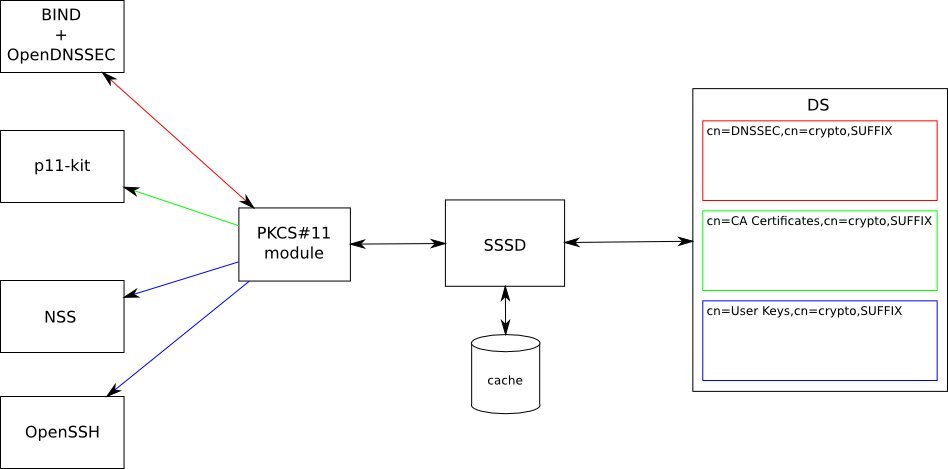

PKCS11_in_LDAP
==============

Overview
========

Store cryptographic objects (public and private keys, certificates) in
LDAP for use by PKCS#11 soft-token module.

Use Cases
=========

The PKCS#11 module can be plugged into various applications and provide
the data to them:

-  BIND and OpenDNSSEC - handle DNS zone signing (see
   https://fedorahosted.org/bind-dyndb-ldap/wiki/BIND9/Design/DNSSEC)
-  p11-kit - CA certificate trust information (see `V4/CA certificate
   renewal <V4/CA_certificate_renewal>`__)
-  NSS databases - users' private keys and certificates for SSL client
   authentication
-  OpenSSH - users' private keys for SSH public key authentication
-  ...

Design
======

| 
| |Pkcs11.png|
| The data is organized into subtrees, each representing a token in the
  PKCS#11 module. Access control is handled by ACIs on per-token and
  per-object level.

Object classes:

-  Private key - private key as per PKCS#11 spec
-  Public key - public key as per PKCS#11 spec
-  Certificate - X.509 certificate as per PKCS#11 spec
-  Trust - NSS vendor-specific trust object

The LDAP schema design is on `separate
page <V4/PKCS11_in_LDAP/Schema>`__.

Subtrees/tokens:

-  cn=DNSSEC

   -  private key and public key objects
   -  read and write access for IPA DNS masters, read access to public
      keys for everyone

-  cn=CA Certificates

   -  certificate and trust objects
   -  read access for everyone, write access for IPA masters

-  cn=User Keys

   -  private key and certificate objects
   -  read and write access to individual objects for their owner

How applications interact with PKCS#11
--------------------------------------

-  BIND v9.10b1 - |PKCS functions seen by ltrace while runnin on top of
   SoftHSMv2| |Full log|

   -  uses digest, sign, verify, keygen and RNG functions
   -  does not persist any objects
   -  searches objects by CKA_CLASS, CKA_KEY_TYPE, CKA_ID, CKA_LABEL,
      CKA_TOKEN

-  OpenDNSSEC

   -  uses digest, sign, keygen and RNG functions
   -  persists private key objects with CKA_LABEL, CKA_ID, CKA_KEY_TYPE,
      CKA_SIGN, CKA_DECRYPT, CKA_UNWRAP, CKA_SENSITIVE, CKA_TOKEN,
      CKA_PRIVATE, CKA_EXTRACTABLE and key-type specific attributes
   -  persists public key objects with CKA_LABEL, CKA_ID, CKA_KEY_TYPE,
      CKA_VERIFY, CKA_ENCRYPT, CKA_WRAP, CKA_TOKEN and key-type specific
      attributes
   -  searches objects by CKA_CLASS, CKA_ID
   -  utility "ods-hsmutil test" can test given PKCS#11 module

-  p11-kit

   -  proxies function calls to external PKCS#11 module
   -  does not persist any objects

-  NSS

   -  https://developer.mozilla.org/en/docs/PKCS11_FAQ

-  OpenSSH

   -  uses sign functions
   -  does not persist any objects
   -  searches objects by CKA_CLASS, CKA_ID, CKA_SIGN

The PKCS#11 module needs to provide cryptographic functions, either by
re-using existing solution (e.g. SoftHSM) or by implementing a thin
layer on top of NSS cryptographic functions.

TODO

Implementation
==============

TODO

Feature Management
==================

UI

N/A

CLI

N/A

Major configuration options and enablement
==========================================

N/A

Replication
===========

N/A

Updates and Upgrades
====================

FreeIPA is going to have `Vault <V4/Password_Vault>`__ suitable for key
material storage. There was an proposal to use this Vault as private-key
storage for PKCS#11 module instead of plain LDAP.

This idea was postponed because Vault implementation will take some
time. For now we need to support private-keys stored in LDAP. To be
future-proof, we have to have upgrade path from plain LDAP to Vault.

Please see `discussion on
freeipa-devel <https://www.redhat.com/archives/freeipa-devel/2014-March/msg00148.html>`__
(it was focused on private keys used for DNSSEC).

There are two basic approaches:

-  (a radical one) One-shot migration:

   -  Upon replica-upgrade, convert all private keys from LDAP to Vault
      and replace all private keys in LDAP with a reference to Vault.
   -  Old clients will no longer see private keys over PKCS#11 so
      clients need to be upgraded.
   -  This is feasible only if set of clients is very limited, e.g. only
      DNSSEC machinery (BIND + OpenDNSSEC) running on IPA replicas.

-  (a conservative one) Use configuration information from LDAP (e.g. in
   cn=etc or so) to detect if some old replicas/clients are still in the
   topology and run auxiliary daemon for LDAP<->Vault synchronization.

Dependencies
============

N/A

External Impact
===============

The objects will be accessed mainly through the PKCS#11 module. The
PKCS#11 module will use SSSD as backend.

Backup and Restore
==================

N/A

Test Plan
=========

TODO

RFE Author
==========

`Jan Cholasta <User:Jcholast>`__

.. |PKCS functions seen by ltrace while runnin on top of SoftHSMv2| image:: bind.v9.10.ltrace.pkcs11_functions.log
.. |Full log| image:: Bind.v9.10.ltrace.log