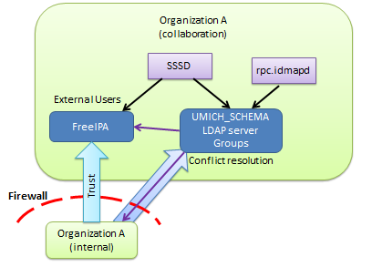
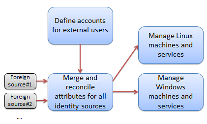

Use_Case_for_Views:_Collaboration
=================================

Introduction
============

This page describes a prototype implementation of a "merged domain" in a
collaboration context. The hosting organization defined a collaboration
environment outside it's security boundary: the network exists outside
the organizational firewall, and corporate machines (i.e., Windows
machines joined to the internal active directory domain) are not allowed
to plug into the collaboration network. The collaboration environment is
distinct from the internal corporate environment to such a degree that
active directory is only leveraged for user authentication and basic
user attributes (sn, givenName, mail, telephoneNumber). This basic
information about corporate users was merged with external users defined
and managed by FreeIPA.

The merging occurred outside of FreeIPA using off-the-shelf tools.
Merged identities were required to authenticate via LDAP simple bind
(primarily for web applications) as well as Kerberos. Upstream user
account entries in LDAP were remapped to a common DIT, specific user
attributes were overridden, and the "umich_schema" was implemented to
support cross realm NFS id mapping. Cross realm posix groups, composed
of a mixture of FreeIPA and AD identities were implemented in this
external directory. Common operations are being identified and are
currently implemented via scripts which are manually run from the
command line. A basic outline of the requirements, approach, and lessons
learned is presented.

This work is envisioned to illustrate one potential application of
"views" and serves as a use case for the work proposed in
https://fedorahosted.org/freeipa/ticket/3979. This work describes a
local linux domain loosely coupled with foreign domains, which act
strictly as identity providers. Foreign identity providers must be able
to authenticate users via Kerberos, but need not provide any descriptive
user attributes. As such, the requirements for a bare Kerberos trust are
well represented here.

Environment
===========

Current situation: LDAP and Kerberos support
--------------------------------------------

The following figure shows the environment in which this prototype was
implemented. An organization has an internal network and a collaboration
network separated by a firewall. Corporate identities are served by the
corporate active directory server. External identities (for
collaborators) are served by FreeIPA. In actuality, the organization in
question is undergoing a phased migration from one active directory
server (agency level) to another (department level, containing many
agencies). Thus there are two upstream active directory servers feeding
identities to the metadirectory server. This is a very specialized
merging situation which creates duplicate user entries for every
identity in the system.

   MergeEnvironment.png

The above diagram optimistically shows a one way "realm trust" (raw
Kerberos trust) from AD to FreeIPA. This trust has not yet been granted.
Without the trust, NFS and SSO functions will not work. Initial
authentication using passwords will work without a trust (anyone can
``kinit``), but sssd cannot verify identities by requesting that the KDC
issue a ``host/fqdn@IPA_REALM`` ticket based on the received TGT. It is
able to decrypt the client part of the ticket using the provided
password, however.

This environment provides the ability to authenticate via ldap simple
bind as well as kerberos. Linux machines can be joined to FreeIPA, and
windows machines which call the collaboration network home (few and far
between) are more or less standalone.

Eventually: Handle windows too
------------------------------

Windows machines calling the collaboration environment home may
eventually be managed by a standalone domain controller. These windows
machines do not have the corporate OS image loaded, and as of this
moment, have no volume licensing agreement (i.e., windows machines on
the collaboration network have neither the corporate OS image nor any
bundled software.) A domain controller may be deployed to manage these
machines, but it will bear no resemblance to the domain controller on
the internal network.

Currently, the collaboration environment is dominated by Linux machines
and Windows machines are few and far between.

Requirements
============

Requirements for upstream identity providers as well as for "identity
processing" once the identities enter the local domain are presented in
the following SysML requirements diagram.

.. figure:: IdentityRequirements.png
   :alt: IdentityRequirements.png

   IdentityRequirements.png

Features of this arrangement include:

-  local control over locally published user attributes, leveraging
   upstream's descriptive and contact attributes where possible.
-  local management of collisions between attribute values which must be
   locally unique (uid, uidNumber, gidNumber)
-  clients in the local domain do not require credentials (or knowledge
   of credentials) in an upstream domain
-  centralized management of all identities accessible to local machines
   and services.
-  locally defined groups which may contain users from any combination
   of local and upstream identities
-  users declare their identity via the same username string to all
   hosts and services within the domain.
-  there is no dependance on any particular upstream user attribute,
   including a SID.

Implementation
==============

Four logical functions
----------------------

For the local domain to provide a consistent set of users to all
services (Windows, Linux, web applications, etc.) a certain amount of
manipulation is necessary. As shown below, the majority of users are
defined in some external user store which can be used for
authentication, but which cannot be assumed to contain any descriptive
user attributes. The foreign identities and locally defined identities
are merged together, and locally important attributes are synthesized if
missing, overridden if conflicting, or passed thru if provided.

   FourFunctions.png

The end result of merging users is to provide central control over a set
of flat local namespaces. Username is one of those namespaces. There
must be a unique mapping from the username to an identity, and central
control ensures that all web applications, services, and desktop logins
respect the *same* mapping. The ``uidNumber`` and ``gidNumber``
attributes also refer to flat namespaces which must not have collisions.
Finally, this setup provides central control over a many-to-one mapping
from ``GSSAuthName`` to user identity (the idea being that your one
local account can support many ways of logging into it: upstream active
directory login, various OpenID providers, SAML, etc.) This is important
for NFSv4 id mapping, and hence filesystem permissions.

Linux and Windows host management are defined as two separate logical
functions because it is likely that they will require separate
controllers targeted for each platform. Hosts, regardless of OS, consume
the merged identities described above.

Merging and Reconciling
-----------------------

Of the four logical functions listed above, this prototype of views is
intended to implement only the "Merge and Reconcile" function. The major
players of this system are depicted in the following SysML block
definition diagram. The components of the system traffic in two major
types of information: LDAP info for identity attributes, and Kerberos
info for authentication. In the case of some web applications, LDAP
traffic is used for authentication as well.

.. figure:: IdentitySystemPlayers.png
   :alt: IdentitySystemPlayers.png

   IdentitySystemPlayers.png

At the present time, the two broad categories of relying parties are:
web applications and POSIX desktops, in the lower right hand corner. The
left hand column represents the components necessary to implement the
merging and reconciling function. At the top of the left column is the
top-level block, identity merge. It is composed of the metadirectory and
override directory blocks, and it is connected to upstream identity
sources.

Note that the metadirectory and override directory traffic only in LDAP
info. These blocks serve only to proxy, remap/merge, and override
attribute information and do not attempt to proxy Kerberos
authentication traffic. This is why the enclosing "identity merge" block
has a single identity port carrying attribute information over LDAP, but
has three individual authentication ports carrying Kerberos traffic.
These Kerberos ports just connect directly back to the KDC which owns
the identity. As noted in the diagram, in ``sssd`` terms this
corresponds to a single merged domain having a single identity provider
and three distinct auth providers. Regardless of the details of
implementation, this characteristic is likely to always crop up when
attempting to create a coherent local view of multiple upstream domains.

Metadirectory block
----------------------------------------------------------------------------------------------

The metadirectory block has been implemented by an instance of OpenLDAP
configured with a single database of type "meta". This database proxies
upstream and local identity sources, remapping them all onto a single
DIT. It only remaps (and does not reconcile). For the upstream sources,
only a handful of user attributes are proxied. The remainder are
discarded. In particular, user attributes relevant to POSIX desktops are
discarded. Even within my agency directory, these attributes have been
inconsistently managed over the years. (Older accounts have some posix
attributes, newer accounts do not.) After the transition to the
department active directory, it is unlikely that any guarantees can be
made regarding collisions between posix attributes created and managed
by the 20 or so substantially autonomous agencies currently being
gathered under one umbrella.

One salient fact to note: It is expressly *not* a requirement that
corporate fileservers (within the firewall) be interoperable with
clients or fileservers in the collaboration environment (outside the
firewall). In fact, intentionally sabotaging such interoperability by
redefining ``uidNumbers`` in the collaboration environment may actually
be considered a security feature.

Existing posix attributes might as well not exist. There is no
compelling reason to respect the existing assignments, particularly if
new assignments can be automatically made. Hence, posix attributes are
stripped out of corporate upstream identity sources by the
metadirectory. All attributes from the FreeIPA server (and hence
"external users") are proxied by the metadirectory server.

The metadirectory server produces a DIT which looks something like this:

-  ``ou=users,ou=remapped,dc=collaboration,dc=example,dc=org``

   -  ``ou=collaboration.example.org`` (served by freeipa, holding
      external users)
   -  ``ou=agency_AD.example.org`` (there is an entire tree under here
      roughly reflecting the organizational structure of my agency)
   -  ``ou=department_AD.example.org`` (currently proxying
      "ou=Agencies", of which my own agency is one)

This DIT structure allows for a single LDAP query with a base DN of
``ou=users,ou=remapped,dc=collaboration,dc=example,dc=org`` to find
users regardless of which identity source contains them.

Override block
----------------------------------------------------------------------------------------------

The override block is implemented by an OpenLDAP server having two "hdb"
style databases. One database contains posix group definitions, with a
suffix of ``ou=groups,ou=local,dc=collaboration,dc=example,dc=org``. The
other database is configured with a translucent overlay, and has an
identical suffix as the above metadirectory:
``ou=users,ou=remapped,dc=collaboration,dc=example,dc=org``. The
translucent overlay is configured to proxy the OpenLDAP server
implementing the Metadirectory block, described above. The database
contains only those attributes which are added or overridden. All other
user attributes are retrieved from the metadirectory server, which in
turn retrieves them from the upstream sources.

The OpenLDAP server implementing the Override block is the server to
which all hosts, services, and web applications in the domain should
connect and query.

Evaluation
==========

Meeting the requirements
------------------------

A basic evaluation of the prototype implementation in terms of the
requirements is portrayed in the following SysML requirements diagram.
By and large the system is functional. Of the two problems noted, only
one requires an additional feature in a software product: ``sssd`` does
not have a vocabulary to describe a merged domain (one identity provider
and multiple auth providers). This more or less forces users to
configure clients with one domain per auth provider, which prevents
``sssd`` from taking advantage of cross-realm groups.

.. figure:: IdentitySystemRequirementAnnotations.png
   :alt: IdentitySystemRequirementAnnotations.png

   IdentitySystemRequirementAnnotations.png

Tasks, Scripts and Automation
-----------------------------

Allocating posix attributes and assigning them to a user is one of the
major functions of this system. The LDAP directories themselves provide
a persistence and publication mechanism, but do not support performing
such an allocation. FreeIPA creates and manages external users. It has
been given a range of ID numbers to use. All other users not managed by
FreeIPA are allocated uidNumbers from a different range. The process is
manual, and is only triggered when someone requires access to a POSIX
desktop (either via ssh, sftp, or because they need to mount an NFS
share.) The algorithm is simple: start issuing uidNumbers at the minimum
value of the range, incrementing the "next value to be assigned" by one
with every assignment. Users who only require access to web applications
are not allocated a uidNumber.

Renaming users is a critical function to manage a migration from one
upstream identity source to another. All of the users will be
duplicated, except for the fact that un-migrated users will fail to
authenticate in the target directory but not the source, and vice-versa
for migrated users. Simple LDAP queries cannot return more than one DN
when querying for a user, because that may well confuse the vast
majority of web applications. In my case, the offending copy of the
users identity was renamed to "not-".

Recommendations
===============

-  Enhance the FreeIPA/``sssd`` identity system such that it can present
   a self-consistent, merged and reconciled view of identities valid for
   use in the local domain. If FreeIPA is going to centralize the
   management of posix attributes assigned to foreign identities, sssd
   should know how to interpret them. Likewise, the correct Kerberos
   principal should be constructed and the correct Kerberos KDC should
   be contacted when initial authentication is necessary.
-  Enhance 389-ds with the rough equivalent of OpenLDAP's "meta"
   database and the translucent overlay. Make it possible to configure
   the metadirectory and the overlay directory in the same server.
-  Automate uidNumber allocation by monitoring ldap requests for the
   uidNumber attribute. (i.e., if the ldap request *for a specific user*
   succeeds in finding a DN for that user, but the uidNumber attribute
   is missing, then assign one, store it, and return it.) Guard against
   bulk assignment of uidNumbers which are probably unintentional (i.e.,
   someone types ``getent passwd``)